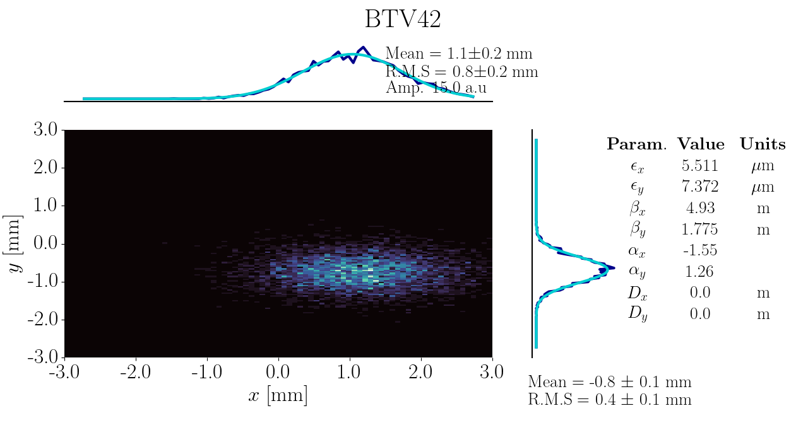
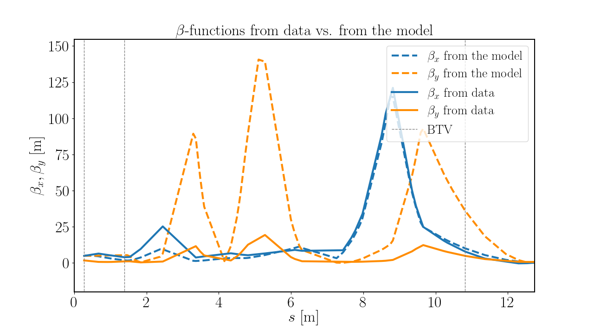

# n_screen_scan

This is code for the calculation of beam paramters such as the emittance, dispersion and Twiss parameters
from BTV data (3+ BTVs required). A BTV is a beam screen, it captures a 2D (x-y) image of the beam as it passes. We need to understand the beam in 6D.

By combining the BTV data with a simulation of the beamline we can reconstruct the initial beam parameters at the start of the beamline. 
To have an accurate model of the beam, it is essential to regularly measure the beam parameters because they can vary from hour-to-hour.

This code pulls the current beamline magnet settings from Git (requires being at CERN for this functionality), takes data from the BTVs (n shots per BTV),
and uses a simulation of the beamline to model the beam dynamics between the BTVs. Beam propagation through magnets and drifts are modelled using 6D matrixes quantified in the code by the parameters R**. 

## Run BTV_run.py

`BTV_run.py` will take parameters from the config file `BTV_config.txt` 
and use `BTV_calculations.py` to take data from the specified number
of BTV detectors to calculate the emittance of the beam. 

This code can be configured to run on saved data or to take real-time
data for analysis.

Tools to plot the 2D projections of the phase space can be found in 
`plotting.py`.

Plots produced as below:

